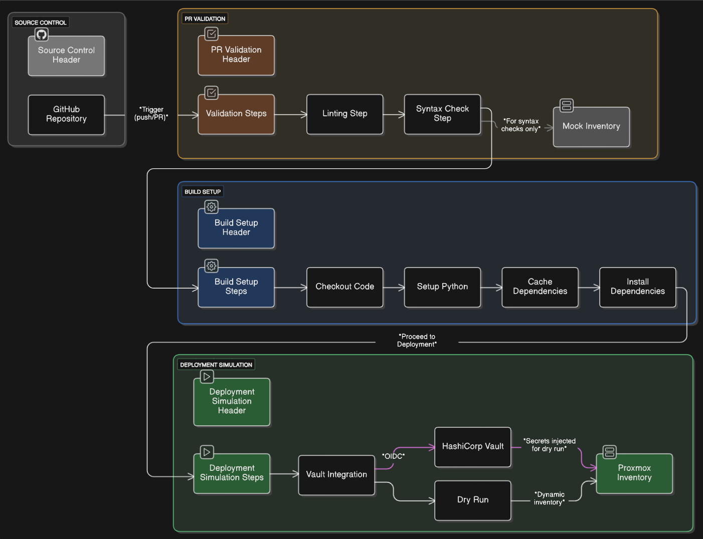

# Homelab Configuration Management (Ansible)

<div align="center">
  
</div>

This repository powers the configuration management for my [FasHomeLab project](https://github.com/fashomelab/corneb), a hybrid homelab inspired by the automation of Horizon's Faro Automated Solutions. What started as manual SSH experimenting on a few Raspberry Pis has evolved into a fully automated, idempotent setup for Proxmox VMs and Pis, with plans for Azure integration. This is my hands-on DevOps playground, showcasing infrastructure as code (IaC), secretless workflows, and CI/CD.

---

## 🌟 Why This Repo?

I built this to tame the chaos of managing my homelab's servers—Raspberry Pis, Proxmox VMs, and soon Azure resources. Initially, I spent hours SSH-ing into each device, but now Ansible automates everything from OS updates to monitoring stacks, cutting deployment time by ~80%. This repo is a core piece of my [FasHomeLab portfolio](https://github.com/fashomelab/corneb), demonstrating real-world skills in configuration management, security, and automation. It's battle-tested for my setup but designed to be reusable—fork it, tweak the vars, and make it yours!

## 🚀 Key Features

- **Hybrid Infrastructure**: Configures on-premise Proxmox hosts (`fashomelab`) with dynamic inventories; Azure (`azhomelab-prod`) integration in progress.
- **Modular Roles**: Reusable roles for Nginx, monitoring (Prometheus/Grafana), security (Fail2Ban/UFW), and more.
- **Dynamic Inventories**: Discovers Proxmox VMs via API, minimizing manual inventory updates.
- **CI/CD Pipeline**: Validates code with `ansible-lint`, syntax checks, and dry runs via GitHub Actions.
- **Secretless Workflow**: Uses HashiCorp Vault with OIDC for secure credential management in CI/CD.

---

### Environments
- **Proxmox (`fashomelab`)**: Fully implemented for on-premise VMs and Raspberry Pis.
- **Azure (`azhomelab-prod`)**: Work in progress. Basic inventory with `azure_rm` plugin; authentication via environment variables. Future expansion planned.

---

## 🏗️ Repository Structure

<pre>
.
├── .github/workflows/ansible-homelab-ci.yaml  # CI pipeline
├── inventory/
│   ├── azhomelab-prod/  # Azure inventory (WIP)
│   ├── ci/              # Mock inventory for CI
│   └── fashomelab/      # Proxmox dynamic/static inventory
├── playbooks/
│   ├── site.yml               # Main playbook
│   └── deploy-interview-app.yml  # Azure app deployment (WIP)
├── roles/  # Modular roles (see below)
└── tools/cache_proxmox_inventory.sh  # Inventory caching script
</pre>

---

## ⚙️ Automation & CI/CD Workflow

The CI pipeline (`.github/workflows/ansible-homelab-ci.yaml`) runs on pushes to `develop`, pull requests to `main`, or changes to `inventory/`, `playbooks/`, `roles/`, or the workflow file itself, performing:

- **Linting**: Ensures code quality with `ansible-lint`.
- **Syntax Check**: Validates syntax using a mock inventory (`inventory/ci/`).
- **Vault Integration**: Uses OIDC to securely fetch secrets from HashiCorp Vault.
- **Dry Run**: Simulates playbook execution (`--check -v`) against the Proxmox inventory.

<div align="center">
  
  <p><em>Secretless Authentication Using OIDC and HashiCorp Vault (image to be updated).</em></p>
</div>

---

## 🚀 Getting Started

### Prerequisites

* Python 3.10+ & `pip`
* Ansible Core (`ansible-core`) or Ansible
* Access to a HashiCorp Vault instance
* Access to a Proxmox VE environment

### Setup

1.  **Clone the Repository**
    ```bash
    git clone [https://github.com/fashomelab/homelab-ansible.git](https://github.com/fashomelab/homelab-ansible.git)
    cd ansible
    ```
    * Note: Fork and customize vars (e.g., inventory/fashomelab/group_vars/) before running, as this is tailored to my setup.

2.  **Set up Python Virtual Environment**
    ```bash
    python3 -m venv venv
    source venv/bin/activate
    pip install -r requirements.txt
    ```

3.  **Install Ansible Collections**
    ```bash
    ansible-galaxy collection install -r requirements.yml
    ```

4.  **Set Environment Variables**
    ```bash
    export VAULT_ADDR="http://your-vault-address:8200"
    export VAULT_TOKEN="your-vault-token" # Or use another auth method
    export PROXMOX_USER="your-proxmox-api-user@pve"
    export PROXMOX_TOKEN_ID="your-api-token-id"
    export PROXMOX_TOKEN_SECRET="your-api-token-secret"
    ```

---

### Inventory Caching
To improve performance, the Proxmox inventory is cached using `tools/cache_proxmox_inventory.sh`. Run:
```bash
bash tools/cache_proxmox_inventory.sh
```
This saves the inventory to inventory/fashomelab/cached-inventory.json for 1 hour, reducing API calls.

---

## 📋 Playbooks

The main playbook, `playbooks/site.yml`, orchestrates the homelab setup across Proxmox VMs and Raspberry Pis. It’s designed for modularity, using tags to selectively run tasks and host groups to target specific devices. Below is an overview of its structure and usage.

### Playbook Structure
- **Gather Facts** (`tags: always`): Collects facts for all hosts (`raspberry_pis`, `patching_targets`) to ensure accurate inventory data.
- **OS Updates** (`tags: update, patching`): Applies package upgrades to Raspberry Pis and VMs (`patching_targets`) with `serial: 1` to avoid simultaneous reboots.
- **VM Provisioning** (`tags: provision, docker`): Configures new VMs (`newvms`) with sudoers, standard packages, and Docker.
- **Monitoring Server** (`tags: monitoring, monitoring_server`): Deploys Prometheus and Grafana on the central monitoring server (`monitoring_server`, typically a Raspberry Pi).
- **Node Exporter** (`tags: monitoring, node_exporter`): Installs Node Exporter on Pis and VMs (`node_exporter_targets`) for metrics collection.
- **Reverse Proxy** (`tags: certs, security, ufw, fail2ban`): Sets up Nginx, Certbot, UFW, and Fail2Ban on the reverse proxy host (`reverse_proxy`) for secure web access.
- **Portainer Agent** (`tags: portainer_agent`): Deploys Portainer Agent on Pis and VMs (`portainer_agents`) for container management.

---

### Execution

**Run the Main Playbook**
```bash
ansible-playbook playbooks/site.yml -i inventory/fashomelab/
```

**Run Specific Tags**
```bash 
ansible-playbook playbooks/site.yml -i inventory/fashomelab/ --tags nginx_configure
```

**Note:** Azure deployment (`deploy-interview-app.yml`) is a work in progress. Example vars:
```bash
ansible-playbook playbooks/deploy-interview-app.yml -i inventory/azhomelab-prod/ --extra-vars "acr_name=myacr.azurecr.io acr_user=myuser acr_pass=mypass image_repo=interview-app image_tag=latest app_name=interview-app"
```
---

## Roles

Modular roles power the playbook, each with its own `README.md` for details.

### Security
- **fail2ban**: Configures intrusion prevention with email notifications  
  *(tags: security, fail2ban)*  
- **ufw_rules**: Sets up firewall rules for SSH, HTTP, and more  
  *(tags: security, ufw)*  
- **certbot**: Manages Let's Encrypt certificates with Cloudflare DNS  
  *(tags: certs, security)*  

### Monitoring
- **prometheus**: Deploys Prometheus for metrics collection  
  *(tags: monitoring, monitoring_server)*  
- **grafana**: Sets up Grafana for visualization  
  *(tags: monitoring, monitoring_server)*  
- **node_exporter**: Installs Node Exporter for system metrics  
  *(tags: monitoring, node_exporter)*  

### Web & Containers
- **nginx**: Configures Nginx as a reverse proxy with SSL for services like Jellyfin and Vaultwarden  
  *(tags: security)*  
- **docker**: Installs Docker for containerized apps  
  *(tags: provision, docker)*  
- **portainer_agent**: Deploys Portainer Agent for container management  
  *(tags: portainer_agent)*  

### Provisioning
- **configure_users**: Manages user accounts and SSH keys  
  *(tags: provision)*  
- **configure_sudoers**: Sets up sudo privileges  
  *(tags: provision)*  
- **server_provision**: Installs base packages for new VMs  
  *(tags: provision)*  
- **update_system**: Applies OS updates and enables automatic updates  
  *(tags: update, patching)*  

---
**Custom Challenge**: Dynamic host grouping via Proxmox API tags (e.g., `newvms`, `node_exporter_targets`) automates VM discovery and configuration.

---
## 🤝 Contributing
Contributions are welcome! Fork the repo, tweak vars for your setup, or submit PRs to enhance roles or add Azure support. Check issues for ideas.

---
## 📜 License
This project is licensed under the MIT License. See the [LICENSE.md](LICENSE.md) file for details.
